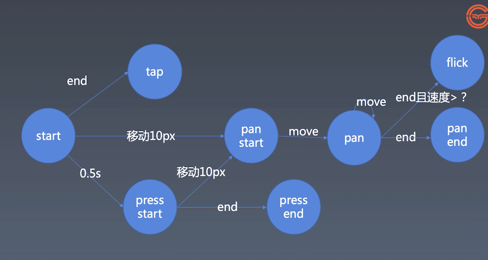

# 手势与动画
## 手势的基本知识
流程图


## 实现鼠标操作
对于鼠标有如下操作：`mousedown, mousemove, mouseup`  
对于gesture有如下对应操作：`touchstart, touchmove, touchend, touchcancel`  
我们对鼠标和gesture进行统一的抽象`start(), move(), end(), cancel()`

## 实现手势的逻辑
根据上面流程图实现`pan, tap, press`手势的区分  
+ press: start()中0.5s的setTimeout触发pressstart, end()触发pressend
+ tap: end()触发tap
+ pan: move()中位移10px触发panstart，之后pan，end()触发panend

## 处理鼠标事件
之前我们只是全局存tap,pan,press状态, 这里我们需要加入context，将这些状态存在context上，来区分事件，我们建立一个contexts的map来存各个触点或者鼠标按键的context
1. 对于手势， 我们使用`touch.identifier`来区分各个触点
2. 对于鼠标
  + mousedown时，根据不同按键的event.button来设置key
  + mousemove时，没有event.button, 有event.buttons,表示哪些键被按下 e.g. 0b11111
  + mouseup时，根据event.button取回context，并删除
  + 避免多个按键按下后，重复监听， 我们设置一个全局变量isListeningMouse来控制

## 派发事件

## 实现一个flick事件
+ flick事件需要计算速度，我们存储一段时间（0.5s）内多个点，来计算平均速度
+ 在start()的时候在context里初始化一个points的数组， move()的时候filter掉0.5s之前的点，end()的时候计算速度

## 封装
对listen -> recognize -> dispatch三步分别进行封装  
```
new Listener(element, new Recognizer(new Dispatcher(element)));
```
